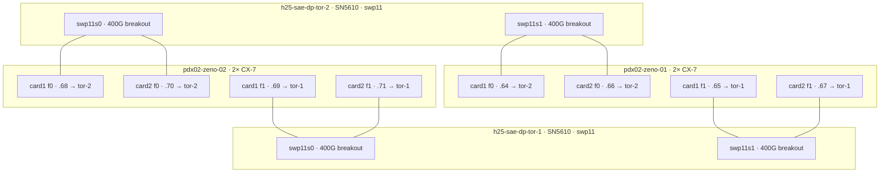

# zeno-01 / zeno-02 CX7 fabric

Export of [zeno fabric topology](/home/aocsa/.cursor/projects/home-aocsa-git/canvases/zeno-fabric-topology.canvas.tsx).

Live LLDP on both NVIDIA DGX Spark boxes versus the claimed card-to-switch map. Source: host `networkctl` + raw systemd-networkd LLDP PDUs · **2026-09-17 18:11 UTC**.

**Card 1 does not go to switch 1.** Both Sparks land on the same SN5610 pair, and each CX-7 really does have two 200G ports. The mapping is by port function, not by card: f0 of both cards → `h25-sae-dp-tor-2`, f1 of both cards → `h25-sae-dp-tor-1`. A 400G→2×200G splitter is on the switch port (`swp11s0` / `swp11s1`), feeding both cards of one host — not both ports of one card onto one switch.

| | |
|---|---|
| Same switch pair | **Yes** |
| Card → one switch | **No** |
| Actual dual-home axis | **f0 / f1** |
| Every CX7 link | **200G** |

## What LLDP actually shows

Each arrow is a 200G RS-FEC fibre link. Identical LLDP source MAC + port ID on both cards of one host means those two 200G PFs share one switch 400G breakout via a splitter.

```
h25-sae-dp-tor-2 · Nvidia SN5610 · swp11
chassis 38:25:f3:38:7f:ba · mgmt 10.87.189.7
        swp11s0 (400G)              swp11s1 (400G)
              |                           |
        400G → 2×200G               400G → 2×200G
         /        \                  /        \
   zeno-02 card1 f0 .68      zeno-01 card1 f0 .64
   zeno-02 card2 f0 .70      zeno-01 card2 f0 .66
         \        /                  \        /
        400G → 2×200G               400G → 2×200G
              |                           |
        swp11s0 (400G)              swp11s1 (400G)
h25-sae-dp-tor-1 · Nvidia SN5610 · swp11
chassis 38:25:f3:38:84:de · mgmt 10.87.189.6
   zeno-02 card1 f1 .69      zeno-01 card1 f1 .65
   zeno-02 card2 f1 .71      zeno-01 card2 f1 .67
```



## Claim vs evidence

| Claim | Verdict | Evidence |
|---|---|---|
| Both boxes on the same switches | Confirmed | Both see `h25-sae-dp-tor-1` (`38:25:f3:38:84:de`) and `h25-sae-dp-tor-2` (`38:25:f3:38:7f:ba`) |
| Card 1 → switch 1, card 2 → switch 2 | Rejected | PCI `0000` and PCI `0002` both dual-home. f0 pair → tor-2, f1 pair → tor-1 |
| Each card has 2 ports | Confirmed | Each MT2910 CX-7 exposes f0+f1 at 200 Gb/s, MTU 9000, RoCE Ethernet |
| 400G to 2×200G splitter | Switch-side | Two host PFs share one LLDP PDU; Cumulus names `swp11s0`/`s1` on SN5610 `swp11` |

## Per-port neighbors

| Host | Card / PCI | netdev | IPv4 | LLDP switch | Switch port | LLDP src MAC |
|---|---|---|---|---|---|---|
| zeno-02 | 1 `0000:01:00.0` | `enp1s0f0np0` | 10.87.131.68 | tor-2 | `swp11s0` | `38:25:f3:4f:99:1a` |
| zeno-02 | 1 `0000:01:00.1` | `enp1s0f1np1` | 10.87.131.69 | tor-1 | `swp11s0` | `38:25:f3:4f:92:4e` |
| zeno-02 | 2 `0002:01:00.0` | `enP2p1s0f0np0` | 10.87.131.70 | tor-2 | `swp11s0` | `38:25:f3:4f:99:1a` |
| zeno-02 | 2 `0002:01:00.1` | `enP2p1s0f1np1` | 10.87.131.71 | tor-1 | `swp11s0` | `38:25:f3:4f:92:4e` |
| zeno-01 | 1 `0000:01:00.0` | `enp1s0f0np0` | 10.87.131.64 | tor-2 | `swp11s1` | `38:25:f3:4f:99:1c` |
| zeno-01 | 1 `0000:01:00.1` | `enp1s0f1np1` | 10.87.131.65 | tor-1 | `swp11s1` | `38:25:f3:4f:92:50` |
| zeno-01 | 2 `0002:01:00.0` | `enP2p1s0f0np0` | 10.87.131.66 | tor-2 | `swp11s1` | `38:25:f3:4f:99:1c` |
| zeno-01 | 2 `0002:01:00.1` | `enP2p1s0f1np1` | 10.87.131.67 | tor-1 | `swp11s1` | `38:25:f3:4f:92:50` |

tor-1 = `h25-sae-dp-tor-1` · chassis `38:25:f3:38:84:de` · mgmt `10.87.189.6`. tor-2 = `h25-sae-dp-tor-2` · chassis `38:25:f3:38:7f:ba` · mgmt `10.87.189.7`. Both Cumulus 5.13.1 on Nvidia SN5610.

## Management plane

Healthy. Default route is the 1G Realtek `enP7s7`, not the CX-7s.

- zeno-02 `10.87.131.182/26` → gw `10.87.131.129` (0.26 ms)
- zeno-01 `10.87.131.181/26`, same gateway
- Internet via that path: 8.8.8.8 ~19 ms, `google.com` HTTP 200

## Splitter placement

Inferred. Transceiver EEPROM needs root (`ethtool -m` → operation not permitted), so the optic part number was not read.

SN5610 `swp11` is broken out; `s0` vs `s1` have adjacent LLDP source MACs. Each 400G breakout presents one LLDP identity to two 200G host PFs — the 400G→2×200G splitter is on that switch port, one splitter per ToR per Spark.

## If the claim were true

Card 1 (`0000:01:00`) would show one chassis on both f0 and f1, and card 2 (`0002:01:00`) the other chassis. Instead each card sees both chassis, and the two cards share byte-identical LLDP frames pairwise (`enp1s0f0np0` ≡ `enP2p1s0f0np0`, `enp1s0f1np1` ≡ `enP2p1s0f1np1` on zeno-02).

CX-7 data IPs also ping: zeno-02 `.68–.71` ↔ zeno-01 `.64–.67`, 0.1–0.3 ms. Fabric MTU 9000, RoCE link-layer Ethernet, no bond. DNS only on the 1G NIC (`103.247.36.36`).

## zeno-03 (same dual-home, not in this LLDP snapshot)

The 2026-09-17 canvas covers zeno-01 and zeno-02 only. zeno-03 is the third Spark used by the NIXL and Flight runs. Same two ToRs, different breakout: **swp12s1** (zeno-01 is `swp11s1`, zeno-02 is `swp11s0`). Prefix `10.87.131.0/25`. Switch is not the bottleneck (SN5610).

| Rail | ToR | RoCE twins | zeno-01 | zeno-02 | zeno-03 |
|---|---|---|---|---|---|
| f0 QSFP | h25-sae-dp-tor-2 | `rocep1s0f0` + `roceP2p1s0f0` | .64 + .66 | .68 + .70 | .72 + .74 |
| f1 QSFP | h25-sae-dp-tor-1 | `rocep1s0f1` + `roceP2p1s0f1` | .65 + .67 | .69 + .71 | .73 + .75 |

Mgmt (1G, not CX-7): zeno-01 `.181`, zeno-02 `.182`, zeno-03 `.183`.

Same function number on both PCI devices is one QSFP. Mixing f0 with f1 on a single x4 is the 12.5 GB/s failure mode. Source for the IP map: `nixl-bench/env.sh` and `flight-bench/env.sh`.
